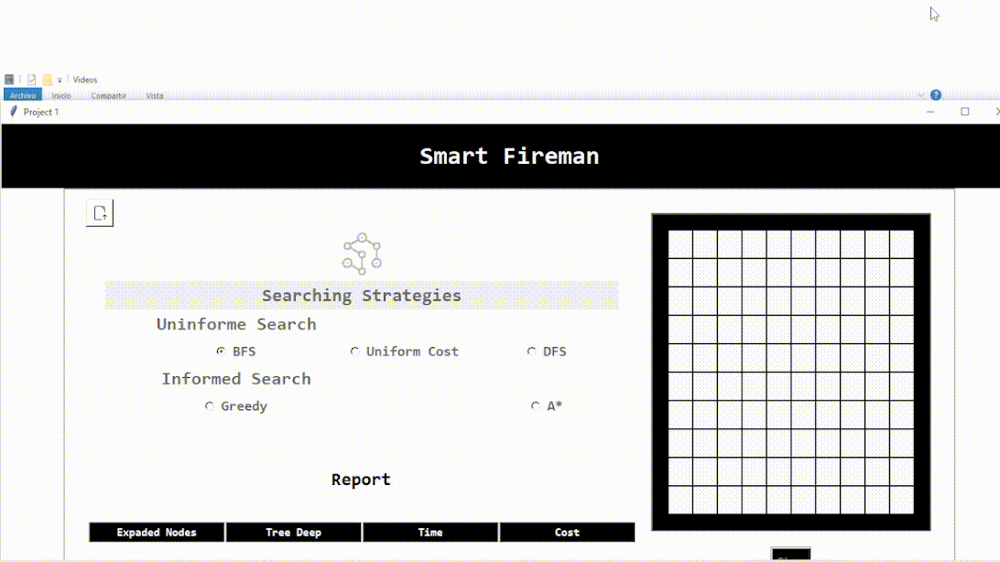

# Firefighter AI Project

Welcome to the Firefighter AI project repository! This repository contains the code related to the first project of the Artificial Intelligence course.

## Project Description

The objective of this project is to develop an AI system that assists a firefighter in extinguishing fires on a 10x10 grid. The project involves applying informed and uninformed searching algorithms to efficiently navigate the grid and extinguish fires using a water bucket.

### Take a look!

## Getting Started

To run the project, follow these steps:

1. Ensure you have Python installed on your machine
2. Clone this repository to your local machine.
3. Navigate to the project directory.
4. Run the main Python script to execute the AI system using the console command:\

`python gui.py `

5. The Tkinter GUI will be launched, allowing interaction with the AI system.

## Algorithms Implementation

### Uninformed search

1. Breath First Search [📄](proyecto/bfs.py)
2. Deep First Search [📄](proyecto/dfs.py)
3. Uniform Cost [📄](proyecto/ucs.py)

### Informed search

4. Greddy [📄](proyecto/greedysearch.py)
5. A\* [📄](proyecto/astartsearch.py)

## Caution

Some improvements should be made. Those are listed below:

1. The calculation of the final depth of the tree has a mistake.
2. Important improvements should be made to reuse code and improve the design of the application by using design patterns.
3. The user interface should be done using web technology.

Note: I will make these improvements progressively.

## Contributing

Contributions to this project are welcome! Feel free to fork the repository, make improvements, and submit pull requests.

## License

This project is licensed under the [MIT License](LICENSE).
